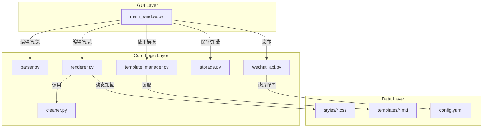

# 项目改进计划

本文档旨在对 `MdToWeChat` 项目进行全面分析，并提出一系列旨在增强其**灵活性、健壮性、可维护性和用户体验**的改进建议，代码要符合PEP8标准。

## 1. 架构优化 (高优先级)

架构是项目的基石。通过优化架构，我们可以为未来的功能扩展和维护打下坚实的基础。

### 1.1. 动态主题系统

*   **现状**: 主题样式（如 `BLUE`, `GEEK_BLACK` 等）被硬编码在 `styles.py` 文件的 Python 字典中。`styles/` 目录下的 `.css` 文件并未被实际使用，这使得添加新主题或修改现有主题变得繁琐且不直观。
*   **改进建议**: 重构 `MarkdownRenderer`，使其能够**动态加载和解析 `styles/` 目录下的所有 `.css` 文件**。每个 `.css` 文件代表一个主题，文件名即主题名。
*   **实施计划**:
    1.  修改 `MarkdownRenderer` 的 `_load_theme` 和 `get_available_themes` 方法，使其扫描 `styles/` 目录来发现主题。
    2.  实现一个简单的 CSS 解析器，该解析器能读取 `.css` 文件内容，并将其中的规则（如 `h1 { color: red; font-size: 24px; }`）转换为 Python 字典（如 `{'h1': 'color: red; font-size: 24px;'}`）。
    3.  `gui/main_window.py` 中的主题菜单将根据扫描到的文件动态生成。
*   **收益**:
    *   **高度灵活性**: 用户只需在 `styles` 目录下添加或修改 CSS 文件，就能轻松创建、分享和切换自己的主题，无需修改任何 Python 代码。
    *   **易于维护**: 样式与代码分离，符合前端开发的标准实践。

### 1.2. 渲染器责任分离

*   **现状**: `core/renderer.py` 中的 `MarkdownRenderer` 类承担了从“Markdown 转 HTML”、“应用主题”到“微信兼容性修复”的全部工作，职责过重。
*   **改进建议**: 将微信兼容性处理逻辑（特别是 `_process_lists` 和 `_filter_unsupported_elements` 方法）剥离出来，放入一个新的 `WeChatHTMLCleaner` 类中。
*   **实施计划**:
    1.  创建新文件 `core/cleaner.py` 并定义 `WeChatHTMLCleaner` 类。
    2.  将相关的兼容性修复方法从 `MarkdownRenderer` 移动到新类中。
    3.  `MarkdownRenderer` 的 `render` 方法在完成基础渲染和主题应用后，调用 `WeChatHTMLCleaner` 对 HTML 进行“清洗”。
*   **收益**:
    *   **单一职责**: 代码结构更清晰，每个模块的职责更单一。
    *   **可测试性**: `Cleaner` 模块可以被独立测试，确保其在各种 HTML 结构下都能正常工作。

### 优化后架构图

## 2. 功能增强

在现有功能基础上进行优化，提升专业性和实用性。

### 2.1. 代码块语言显示

*   **现状**: 代码块样式精美，但无法显示其编程语言（例如 `python`, `javascript`），降低了技术文章的可读性。
*   **改进建议**: 在 `_apply_mac_style_to_code_blocks` 方法中，解析 `markdown` 库为 `<pre>` 标签生成的 `class` 属性（其中包含了语言信息），并将其显示在模拟窗口的标题栏上。
*   **收益**: 显著提升技术类文章的专业性和阅读体验。

### 2.2. 健壮的图片处理

*   **现状**:
    1.  `find_media_id_by_url` 方法通过遍历线上所有素材来查找 `media_id`，在素材库较大时效率极低且不可靠。
    2.  网络图片每次发布时都会被重新下载和上传，浪费时间和 API 调用次数。
*   **改进建议**:
    1.  **废弃 `find_media_id_by_url`**。逻辑统一为：优先上传，并信任上传后返回的结果。
    2.  **引入本地图片缓存**: 创建一个本地数据库或 JSON 文件，用于记录 `原始图片URL -> 微信图片URL` 的映射。所有图片（本地、网络）在上传前都先检查此缓存。
*   **收益**: 大幅提升发布速度，减少不必要的 API 调用，增强发布的稳定性。

### 2.3. 使用 AST 进行内容解析

*   **现状**: `ContentParser` 完全依赖正则表达式来提取标题、作者等元信息，对于某些边缘情况（如标题中包含特殊符号）可能不够稳定。
*   **改进建议**: 放弃纯正则的解析方式。利用 `markdown` 库的扩展 API，通过分析其生成的**抽象语法树（AST）**来提取元信息。
*   **收益**: 解析过程更稳定、更精确，能更好地处理复杂的 Markdown 文档。

## 3. 代码质量与用户体验

提升应用的健壮性和交互流畅度。

### 3.1. 异步任务处理

*   **现状**: 发布、抓取网页等耗时网络操作会阻塞 GUI 主线程，导致界面“假死”，用户无法进行其他操作。
*   **改进建议**: 使用 PyQt 的 `QThread` 将这些长耗时任务移至后台线程执行。通过**信号与槽（Signal & Slot）机制**将任务进度（如“正在上传第 2 张图片...”）和最终结果（成功或失败信息）安全地传递回主线程以更新 UI。
*   **收益**: 应用在处理耗时任务时能保持流畅响应，用户体验大幅提升。

### 3.2. 统一配置管理

*   **现状**: 配置分散在各个模块中加载，`WeChatAPI` 在设置更改后需要重新实例化来加载新配置。
*   **改进建议**: 创建一个单例的 `ConfigManager` 类，在应用启动时加载 `config.yaml`。所有需要配置的模块都从这个管理器中获取信息。当用户在设置对话框中保存时，只更新这个管理器的状态并同步写入文件，无需重新创建任何对象实例。
*   **收益**: 实现更优雅的全局状态管理，代码更简洁，耦合度更低。