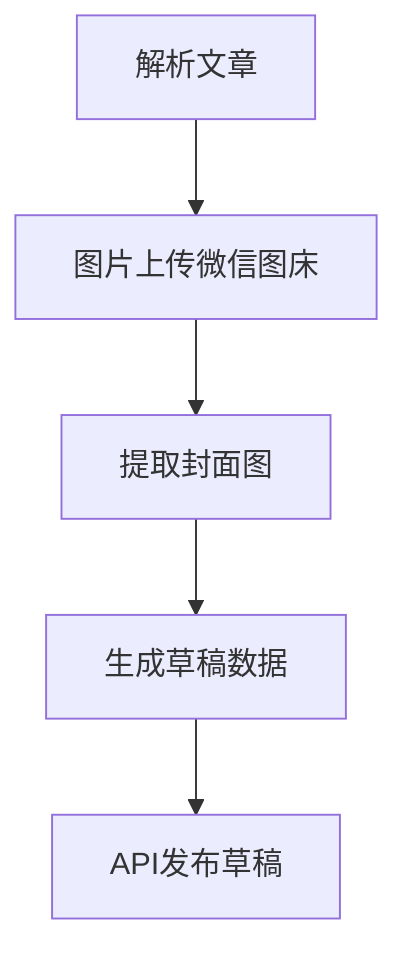

# 微信公众号Markdown渲染发布系统需求文档

**版本**: 2.0
**日期**: 2025-07-01

---

#### **1. 项目概述**
**目标**：开发桌面端应用，实现Markdown实时渲染、多模板支持、本地化管理及微信公众号草稿发布全流程自动化，支持单图文和多图文发布。
**核心功能**：
- Markdown → 微信公众号兼容HTML的实时渲染
- 可扩展样式模板管理
- 按日归档的本地存储
- 微信公众号草稿自动化发布（含图床处理）
**用户角色**：内容编辑/公众号运营者

---

#### **2. 详细需求说明**

##### **2.1 Markdown 编辑与渲染模块**
| 功能                 | 详细要求                                                                                                                                                                                                            |
|----------------------|---------------------------------------------------------------------------------------------------------------------------------------------------------------------------------------------------------------------|
| **实时渲染引擎**     | 输入Markdown即时输出微信公众号兼容HTML（过滤非法标签/样式）。已优化列表渲染（`_process_lists`函数），确保在微信公众号编辑器中稳定显示，且 `[toc]` 仅显示二、三级标题。                                            |
| **样式模板系统**     | 支持加载本地CSS模板目录，默认提供多套主题。所有主题的 `img` 标签已适配 `max-width: 100%`。所有主题的段落间距（`section` 和 `p` 标签）已优化，使其更紧凑。代码块样式已统一优化，确保在亮色和暗黑模式下都清晰可读。 |
| **编辑界面**         | 三栏设计：左侧为文章列表（新增），中间为Markdown编辑器，右侧为HTML实时预览。Markdown编辑器已优化字体和行高，并提供格式提示。                                                                                           |
| **内容提取**         | 自动识别文档元数据：`# 标题`→标题，`> 作者`→作者（可手动覆盖）。                                                                                                                                                       |

##### **2.2 本地存储模块**
```plaintext
存储结构：
/data/
├── 2024-06-29/         // 按日创建文件夹
│   ├── 文章1_时间戳.md       // 原始Markdown
│   ├── 文章1_时间戳.html     // 渲染后HTML
│   └── cover_img1.jpg // 封面图（自动提取并复制到当日文件夹）
```
- **保存逻辑**：
  1. 点击保存时自动创建当日文件夹（若不存在）。
  2. 文件名生成规则：`标题_时间戳.md` 和 `标题_时间戳.html`（标题截取前20字符）。
  3. **发布即保存**：在执行发布操作时，会自动将该次发布的最终 HTML 内容保存到本地。
  4. 多文章关联：通过`group_id`字段标记同批次文章 (未来扩展)。

##### **2.3 微信公众号发布模块**
**核心流程**：


**API接口规范**（基于[微信官方文档](https://developers.weixin.qq.com/doc/offiaccount/Draft_Box/Add_draft.html)）：
| 接口类型            | 请求示例                                                                 |
|---------------------|--------------------------------------------------------------------------|
| **图片上传**        | `POST https://api.weixin.qq.com/cgi-bin/media/uploadimg?access_token=XXX`<br>FormData: `file=@local.jpg` |
| **创建草稿**        | `POST https://api.weixin.qq.com/cgi-bin/draft/add?access_token=XXX`<br>Body: JSON见下方示例 |
| **新增永久图文素材**| `POST https://api.weixin.qq.com/cgi-bin/material/add_news?access_token=XXX`<br>Body: JSON见下方示例 |

**草稿JSON结构**：
```json
{
  "articles": [
    {
      "title": "自动提取标题",
      "author": "默认作者（可配置）",
      "content": "<HTML内容>",
      "thumb_media_id": "封面图MediaID",
      "content_source_url": "",
      "show_cover_pic": 1
    }
    // ...更多文章对象（用于多图文）
  ]
}
```

**关键自动化处理**：
- 封面图：优先取文档首图 → 无图时使用默认封面（需预先上传）。**模板中的图片不会被识别为封面。**
- 作者：读取Markdown的`> 作者`行 → 未指定时使用用户配置的默认作者。
- 图片处理：本地路径→上传微信图床→替换HTML中URL（支持``）。

##### **2.4 多图文草稿支持 (新增功能)**
- **多文章管理**：
    - 主窗口左侧新增“文章列表”面板，用于集中管理当前草稿中的所有文章。
    - 提供“新增文章”按钮，可添加新的空白文章。
    - 支持删除文章（至少保留一篇）。
    - 点击文章列表项可切换编辑当前文章，同时自动保存前一篇文章内容。
- **发布逻辑**:
    - 发布时，遍历所有文章，分别进行图片上传、HTML渲染、封面图提取。
    - 最终调用 `create_multi_article_draft` 接口，将所有文章作为一个整体发布为多图文草稿。

---

#### **3. 技术规范**

##### **3.1 数据流设计**
```plaintext
Markdown输入 (多文章)
  → [渲染引擎] → 微信公众号HTML (每篇文章)
  → [内容解析器] → 提取{标题,作者,图片} (每篇文章)
  → [微信API适配器] → 草稿发布 (单图文/多图文)
```

##### **3.2 微信API安全要求**
| 安全措施            | 实现方案                                  |
|---------------------|------------------------------------------|
| Access Token管理    | 本地加密存储，自动刷新（有效期2小时）     |
| 敏感数据存储        | 使用系统密钥库保存AppSecret              |
| 请求重试机制        | 网络异常时自动重试（3次/指数退避）       |

##### **3.3 错误处理**
- **图片上传失败**：保留原始链接并弹出警告。
- **API限流**：等待15秒后自动重试。
- **草稿验证失败**：返回微信错误码对照表（如44001无效Token）。
- **Markdown解析错误**: 自动修复 `<![...]` 等不规范格式以防止崩溃。

---

#### **4. 非功能性需求**
| 类别       | 要求                          |
|------------|-------------------------------|
| **性能**   | 渲染延迟<200ms（万字符内）   |
| **存储**   | 本地文章保留30天（可配置）   |
| **扩展性** | 支持插件机制扩展新模板        |
| **安全**   | 所有API请求通过HTTPS加密      |
| **UI响应** | 界面操作流畅，无明显卡顿      |

---

#### **5. 交付物清单**
1.  **核心组件**：
    *   Markdown渲染引擎（兼容CommonMark，列表/TOC优化）
    *   微信API-SDK（含Token管理/错误处理，支持多图文）
    *   本地存储管理器（按日归档）
    *   模板管理器
2.  **用户界面**：
    *   主窗口（三栏布局，文章列表管理）
    *   模板编辑器对话框
    *   发布确认对话框
3.  **配置文件**：
    *   `config.yaml`（存储微信凭证/默认作者/模板路径）
4.  **日志系统**：
    *   操作日志：`logs/operation_[date].log`
    *   API错误日志：`logs/api_error_[date].log`

---

#### **6. 开发里程碑 (已完成)**
1.  **Phase 1**（核心渲染）：
    *   实现Markdown→HTML渲染引擎 + 模板系统
    *   完成本地存储模块
2.  **Phase 2**（微信集成）：
    *   实现图片上传/草稿发布API（支持多图文）
    *   开发元数据自动提取器
3.  **Phase 3**（增强功能）：
    *   增加多文章批量发布
    *   开发模板管理GUI
    *   UI界面优化（自适应、暗黑模式、编辑器提示、右键菜单简化）

---

> **备注**：本文档严格遵循微信官方API规范（2024版），开发者需优先参考：[微信公众号开发文档](https://developers.weixin.qq.com/doc/offiaccount/Getting_Started/Overview.html)
